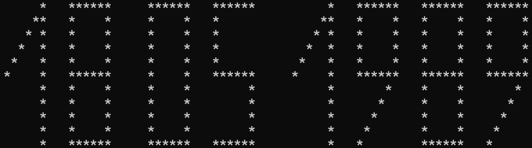

**Программа, которая по дню, месяцу и году рождения определяет некоторые факты**

➔    Программа запрашивает у пользователя последовательно день его рождения, месяц и год;

➔    Выводит в консоль, какому дню недели соответствует эта дата;

➔    Определяет - високосный это был год, или нет;

➔    Определяет сколько сейчас лет пользователю;

➔    Выводит в консоль дату рождения пользователя в формате дд мм гггг, где цифры прорисованы звёздочками (*), как на электронном табло.

### Как запустить проект:

На вашем компьютере должен быть установлен Python версии 3.7 и выше.
Запуск проекта будет показан на примере использования терминала (для Linux и MacOS) и Git Bush (для Windows).
Установите программное обеспечение по одной из следующих инструкций:

Инструкция для Windows
```
Установите программное обеспечение: скачайте установочные файлы и запустите их.
Python: www.python.org/downloads/
Visual Studio Code: code.visualstudio.com/download
Git: git-scm.com/download/win
```
Инструкция для macOS
```
Первым делом установим утилиты разработчика, после этого — менеджер пакетов Homebrew https://brew.sh/, а потом, уже через HomeBrew, установим все остальные программы.
Запустите программу Терминал (или Terminal.app), она находится в директории /Applications/Utilities/. Все команды будем выполнять в окне этой программы.
По шагам
Установите утилиты разработчика. Для этого в терминале запустите такую команду:
xcode-select --install
При установке скачается довольно большой файл. Хорошая новость в том, что после этого ваш компьютер станет Настоящим Компьютером Программиста. Во время установки система попросит подтвердить лицензию на установку. Соглашайтесь.
Устанавливаем менеджер пакетов brew (скопируйте код со страницы brew.sh/index_ru):
/bin/bash -c "$(curl -fsSL https://raw.githubusercontent.com/Homebrew/install/HEAD/install.sh)"
Теперь можно установить Python и Git, это можно сделать одной командой:
brew install python@3.7 git
Устанавливаем редактор Visual Studio Code из дополнительного набора пакетов:
brew install --cask visual-studio-code
```
Инструкция для Linux (Ubuntu)
```
Запустите программу Терминал.
Сперва установите Python, для этого в терминале выполните команду
sudo apt-get install python3.7 
Перед установкой терминал попросит вас ввести пароль администратора — сделайте это.
По такой же схеме установите Git
sudo apt-get install git 
Чтобы установить редактор вам понадобится менеджер пакетов snap. Установите его командой
sudo apt install snap 
Устанавливаем редактор Visual Studio Code из дополнительного набора пакетов:
sudo snap install code --classic 
После того, как всё скачается и установится, вы сможете запустить Visual Studio Code командой code в терминале.
```

Для запуска проекта 
```
На macOS или Linux запустите программу Терминал. Если у вас Windows — запускайте Git Bash.
В открывшемся окне вы увидите:
имя вашего компьютера,
имя, под которым вы авторизовались в компьютере
символ доллара $ — отображение этого символа означает, что программа ждёт ваших команд. В зависимости от операционной системы порядок и вид этой информации может немного различаться
Сразу после запуска программы вы оказываетесь в домашней директории. Это каталог, где (по умолчанию) располагаются пользовательские файлы.
```
Клонируйте репозиторий с проектом в вашу домашнюю директорию такой командой:
```
git clone https://github.com/genpoplevin/synergy_practice_06_2024.git
```

Перейдите в репозиторий в командной строке:
```
cd synergy_practice_06_2024
```


Запустите проект:

```
python3 .\case_2\case_2.py
либо
python .\case_2\case_2.py
```
Теперь в консоли запустится программа, куда можно будет ввести дату рождения

### Примеры

Программа, которая по дню, месяцу и году вашего рождения определяет некоторые факты.  
Введите день вашего рождения: 18  
Введите месяц вашего рождения в числовом формате: 05  
Введите год вашего рождения: 1989  
День недели вашего рождения: четверг  
Год вашего рождения невисокосный  
Вам 35 лет.  
Дата вашего рождения:  



